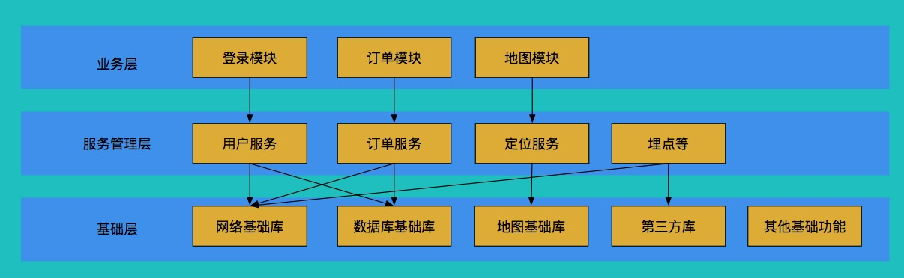
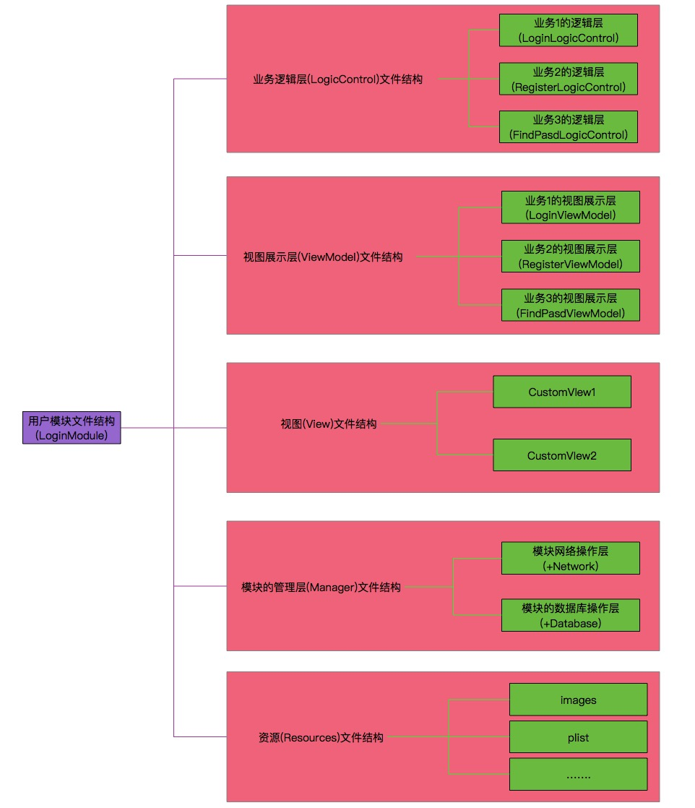
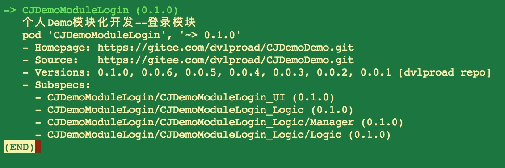

# CJStandardProject
架构Demo:展示规范开发的示例

实现清晰，目的明确的层次划分，并能在后续快速接入使用组件化开发。


## 版本介绍/更新记录
* 2018-08-29

> 1. 添加展示规范开发的初始示例CJStandardProjectDemo；


## Screenshot
#### 1、层次图
> 

#### 2、模块文件结构图
模块文件结构图示例
> 

模块文件结构图示例
> 

#### 3、pod结构
pod结构
> 

#### 4、Demo
Demo请查看[CJStandardProjectDemo](./CJStandardProjectDemo)

## 前言
架构是为了良好的处理需求。

而架构的理解，最后结合设想/实际需求理解。

#### 设想需求
先插入讲下业务逻辑常处理什么？
> 答：如根据登录的用户Type，进入不同的首页；


##### 1、某个操作可能在多个模块中都需要使用
> 
```
举例：登录操作在多个模块使用。
描述：从不同页面(游客模式时候)进入登录页，登录成功后回到首页
①、未进入首页时候，会提供登录方式来正式使用首页；
②、已进入首页但未登录(如游客模式)，在点击需要登录才使用的功能(如个人信息、订单等)，需要提供登录方式来使用该功能
```

希望至少达到的目的：
>
```
复用上的考虑
①、对网络请求和DB操作：可以复用
②、对逻辑处理：如根据登录的用户Type，进入不同的首页，这边暂不处理。
```


## 一、文件结构解释
首先每个UIViewController有业务和视图，将业务逻辑和视图展示完全分开，分别放置在`LogicControl文件夹`和`ViewModel文件夹`。

#### 1、LogicControl
###### ①、是否可复用上
如果非要讨论的话：
> `LogicControl文件夹`里的：可复用

###### ②、LogicControl处理的事情
拿`LoginLogicControl.h`举例

LoginLogicControl处理：

```
@interface LoginLogicControl : NSObject {
    
}
@property (nonatomic, weak) id<LoginLogicControlDelegate> delegate;

#pragma mark - Getter
- (NSString *)getLastLoginAccount;
- (NSString *)getLastPasswordForUserName:(NSString *)userName;

#pragma mark - Update
- (void)updateUserName:(NSString *)userName;
- (void)updatePassword:(NSString *)password;

#pragma mark - Do
///执行登录
- (void)login;

@end
```


LoginLogicControl处理结果

```
@protocol LoginLogicControlDelegate <NSObject>

///登录按钮的enable发生变化需要更新按钮显示
- (void)logic_LoginButtonEnableChange:(BOOL)enable;

///尝试登录时候，未满足条件时候
- (void)logic_tryLoginFailureWithMessage:(NSString *)message;

///开始登录时候更新视图显示提示信息
- (void)logic_startLoginWithMessage:(NSString *)message;

///登录成功需要进入主页
- (void)logic_loginSuccessAndGoMainViewControllerWithMessage:(NSString *)message;

///登录成功需要回到主页
- (void)logic_loginSuccessAndBackMainViewControllerWithMessage:(NSString *)message;

///登录失败更新视图显示提示信息
- (void)logic_loginFailureWithMessage:(NSString *)message;

@end
```


#### 2、ViewModel
###### ①、是否可复用上
如果非要讨论的话：
> `ViewModel文件夹`里的：可复用

###### ②、ViewModel处理的事情
拿`LoginViewModel.h`举例

LoginViewModel处理

```
@interface LoginViewModel : NSObject <UITextFieldDelegate> {
    
}
@property (nonatomic, weak) id<LoginViewModelDelegate> delegate;

@property (nonatomic, weak) LoginViewController *belongViewController;  //归属的控制器
//@property (nonatomic, strong) UIImageView *portraitBackgroundImageView; /**< 头像背景 */
//@property (nonatomic, strong) UIImageView *portraitImageView;   /**< 头像 */
@property (nonatomic, strong) CJTextField *userNameTextField;   /**< 账号(记得关掉自动纠错) */
@property (nonatomic, strong) CJTextField *passwordTextField;   /**< 密码 */
//@property (nonatomic, strong) UIButton *backButton;             /**< 返回按钮 */
@property (nonatomic, strong) UIButton *loginButton;            /**< 登录按钮 */
@property (nonatomic, strong) UIButton *findPasswordButton;     /**< 找回密码按钮 */
@property (nonatomic, strong) UIButton *registerButton;         /**< 注册按钮 */
@property (nonatomic, strong) MBProgressHUD *loginStateHUD;     /**< 进展状态HUD */


#pragma mark - UpdateView
///更新文本框的值
- (void)updateUserNameTextField:(NSString *)userName;
///更新文本框的值
- (void)updatePasswordTextField:(NSString *)password;
///更新登录按钮的点击状态
- (void)updateLoginButtonEnable:(BOOL)enable;
///开始视图的editing
- (void)startEndEditing;
///结束视图的editing
- (void)stopEndEditing;

///"尝试登录失败(未满足条件)时候"，更新视图
- (void)tryLoginFailureWithMessage:(NSString *)message;

///"开始登录时候"更新视图(如显示提示信息)
- (void)startLoginWithMessage:(NSString *)message;

///“登录成功进入主页时候"更新视图
- (void)loginSuccessAndGoMainViewControllerWithMessage:(NSString *)message;

///"登录成功回到主页时候"更新视图
- (void)loginSuccessAndBackMainViewControllerWithMessage:(NSString *)message;

///"登录失败时候"更新视图
- (void)loginFailureWithMessage:(NSString *)message;

#pragma mark - 界面跳转
///进入"忘记密码"界面
- (void)goFindPasswordViewController;

///进入"注册"界面
- (void)goRegisterViewController;
@end
```


LoginViewModel处理结果

```
@protocol LoginViewModelDelegate <NSObject>

- (void)vm_userNameTextFieldChange:(NSString *)userName;  /**< 用户名文本框内容改变了 */
- (void)vm_passwordTextFieldChange:(NSString *)password;  /**< 密码文本框内容改变了 */

- (void)vm_loginButtonAction;
- (void)vm_registerButtonAction;
- (void)vm_findPasswordButtonAction;

@end
```


#### 3、Manager
  #import "CJDemoServiceUserManager+Network.h"
  
```
@interface CJDemoServiceUserManager (Network)

#pragma mark - Network
///登录
- (void)requestLoginWithAccount:(NSString *)account
                       password:(NSString *)password
                        success:(void (^)(NSDictionary *responseDict))success
                        failure:(void (^)(NSError *error))failure;

///注册
- (void)requestRegisterWithAccount:(NSString *)account
                          password:(NSString *)password
                             email:(NSString *)email
                           success:(void (^)(NSDictionary *responseDict))success
                           failure:(void (^)(NSError *error))failure;


///通过了邮件请求更新密码
- (void)requestNewPasswordWithString:(NSString *)string
                             success:(void (^)(NSDictionary *responseDict))success
                             failure:(void (^)(NSError *error))failure;

///退出
- (void)requestLogoutUid:(NSString *)uid
                 success:(void (^)(NSDictionary *responseDict))success
                 failure:(void (^)(NSError *error))failure;

@end
``` 


 #import "CJDemoServiceUserManager+UserTable.h"
 
```
@interface CJDemoServiceUserManager (UserTable)

- (NSString *)sqlForCreateTable;

- (BOOL)insertAccountInfo:(DemoUser *)info;
- (BOOL)removeAccountInfoWhereName:(NSString *)name;

//update
- (BOOL)updateAccountInfoExceptUID:(DemoUser *)info whereUID:(NSString *)uid;
- (BOOL)updateAccountInfoImagePath:(NSString *)imagePath whereUID:(NSString *)uid;
- (BOOL)updateAccountInfoImageUrl:(NSString *)imageUrl whereUID:(NSString *)uid;
- (BOOL)updateAccountInfoExecTypeL:(NSString *)execTypeL whereUID:(NSString *)uid;

//query
- (DemoUser *)selectAccountInfoWhereUID:(NSString *)uid;
- (UIImage *)selectAccountImageWhereUid:(NSString *)uid;


@end
```


## Author Or Contact
* [邮箱：studyroad@qq.com](studyroad@qq.com)
* [简书：https://www.jianshu.com/u/498d9e6a26e1](https://www.jianshu.com/u/498d9e6a26e1)
* [码云：https://gitee.com/dvlproad](https://gitee.com/dvlproad)


## 结束语