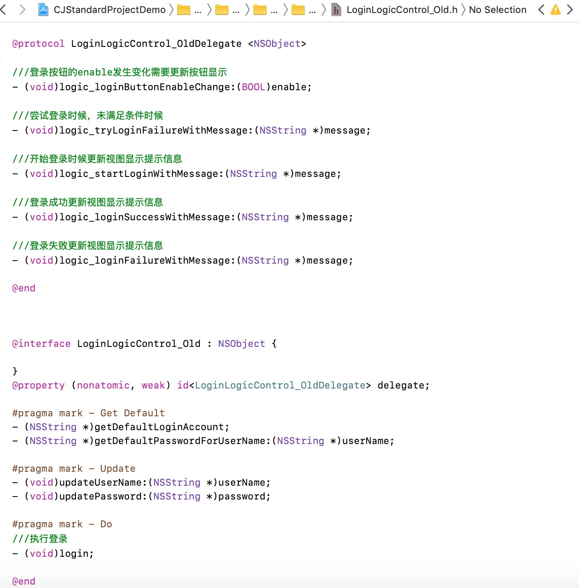
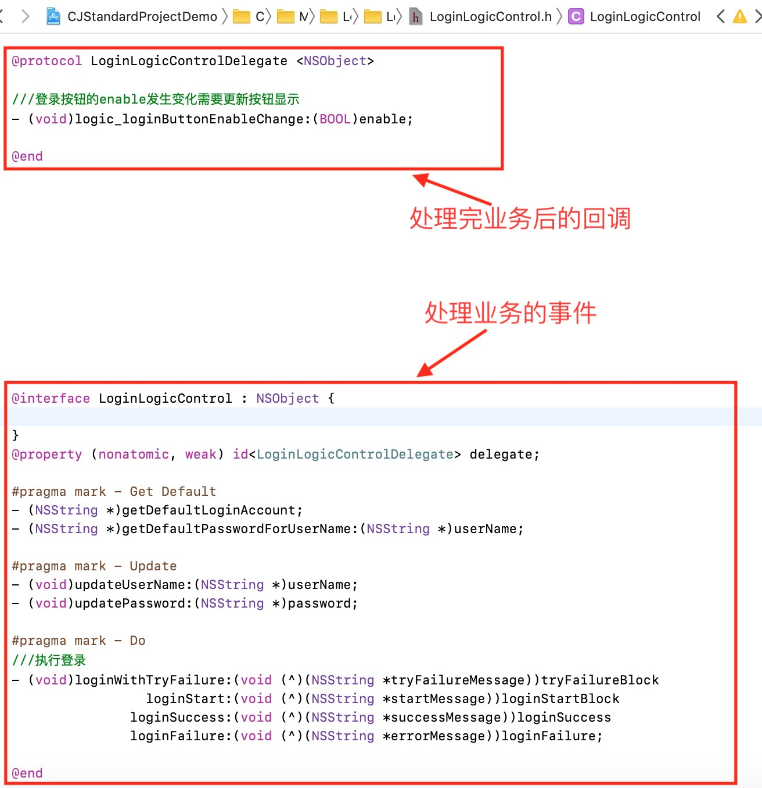

# 规范README
## 前言
#### 几个名词
* LV：LogicContol + ViewControl 
> 将UIViewController的业务(Logic)和视图(View)完全独立到不同类中处理，其余的通过各自的回调到在UIViewController处理。

* LM：LogicModel ，即LV结构中的Logic
> 改善于LV结构，不独立出ViewControl，UIViewController的视图处理仍在ViewController中。

* VM：ViewModel
> 改善于LM结构，将LM改名为VM，同时加入RAC、KVO等绑定功能。

## 一、UIViewController的业务
#### 1、命名：logicControl/viewLogic/ViewModel(可商榷)
#### 2、回调(block与delegate上的选择)：
回调使用原则：由于业务回调经常有多个，为达到统一，而非有时候在初始化之后查看回调，有时候在回调区块中查看，所以回调禁止通过为业务模型添加block属性实现，统一通过delegate实现。

附初始化后的回调，形如：

```
self.viewLogic = [[LoginLogicControl alloc] init];
self.viewLogic.loginButtonEnableChange = ^(BOOL enable) {
	return NO;
}
```

回调区块中查看，形如：

```
 #pragma mark - LoginLogicControlDelegate
 
 ///登录按钮的enable发生变化需要更新按钮显示
- (void)logic_loginButtonEnableChange:(BOOL)enable {

}
```

故，实际代码中的做法，统一如下：

> // 提倡

```
@protocol LoginLogicControlDelegate <NSObject>

///登录按钮的enable发生变化需要更新按钮显示
- (void)logic_loginButtonEnableChange:(BOOL)enable;

///尝试登录时候，未满足条件时候
- (void)logic_tryLoginFailureWithMessage:(NSString *)message;

///开始登录时候更新视图显示提示信息
- (void)logic_startLoginWithMessage:(NSString *)message;

@end


@interface LoginLogicControl : NSObject {

}
@property (nonatomic, weak) id<LoginLogicControlDelegate> delegate;

@end
```

> // 禁止

```
@interface LoginLogicControl : NSObject {

}
@property (nonatomic, copy) void (^loginButtonEnableChange)(BOOL enable);

@end

```


#### 3、特殊回调，方法中
有时候，执行方法的时候就会有回调。直接使用block，不去绕delegate的弯！

实际代码中，如下：

> // 提倡

```
@interface LoginLogicControl : NSObject {

}

#pragma mark - Do
///执行登录
- (void)loginWithTryFailure:(void (^)(NSString *tryFailureMessage))tryFailureBlock
				loginStart:(void (^)(NSString *startMessage))loginStartBlock
				loginSuccess:(void (^)(NSString *successMessage))loginSuccess
				loginFailure:(void (^)(NSString *errorMessage))loginFailure;

@end
```

> // 禁止

```
@protocol LoginLogicControlDelegate <NSObject>

///尝试登录时候，未满足条件时候
- (void)logic_tryLoginFailureWithMessage:(NSString *)message;

///开始登录时候更新视图显示提示信息
- (void)logic_startLoginWithMessage:(NSString *)message;

///登录成功更新视图显示提示信息
- (void)logic_loginSuccessWithMessage:(NSString *)message;

///登录失败更新视图显示提示信息
- (void)logic_loginFailureWithMessage:(NSString *)message;

@end


@interface LoginLogicControl : NSObject {
    
}
@property (nonatomic, weak) id<LoginLogicControlDelegate> delegate;

#pragma mark - Do
///执行登录
- (void)login;

@end

```

#### 4、默认数据与绑定

```
	//显示上次登录的账号
    NSString *userName = [self.logicControl getDefaultLoginAccount];
    NSString *password = [self.logicControl getDefaultPasswordForUserName:userName];
    self.userNameTextField.text = userName;
    self.passwordTextField.text = password;
    
    [self.logicControl updateUserName:userName];
    [self.logicControl updatePassword:password];
```

#### 5、业务逻辑LogicControl改造前后区别（以`LoginLogicControl.h`举例）
改造前的`LoginLogicControl_Old.h`

```
@protocol LoginLogicControl_OldDelegate <NSObject>

///登录按钮的enable发生变化需要更新按钮显示
- (void)logic_loginButtonEnableChange:(BOOL)enable;

///尝试登录时候，未满足条件时候
- (void)logic_tryLoginFailureWithMessage:(NSString *)message;

///开始登录时候更新视图显示提示信息
- (void)logic_startLoginWithMessage:(NSString *)message;

///登录成功更新视图显示提示信息
- (void)logic_loginSuccessWithMessage:(NSString *)message;

///登录失败更新视图显示提示信息
- (void)logic_loginFailureWithMessage:(NSString *)message;

@end


@interface LoginLogicControl_Old : NSObject {
    
}
@property (nonatomic, weak) id<LoginLogicControl_OldDelegate> delegate;

#pragma mark - Get Default
- (NSString *)getDefaultLoginAccount;
- (NSString *)getDefaultPasswordForUserName:(NSString *)userName;

#pragma mark - Update
- (void)updateUserName:(NSString *)userName;
- (void)updatePassword:(NSString *)password;

#pragma mark - Do
///执行登录
- (void)login;

@end
```

改造后的`LoginLogicControl`

```
@protocol LoginLogicControlDelegate <NSObject>

///登录按钮的enable发生变化需要更新按钮显示
- (void)logic_loginButtonEnableChange:(BOOL)enable;

@end


@interface LoginLogicControl : NSObject {
    
}
@property (nonatomic, weak) id<LoginLogicControlDelegate> delegate;

#pragma mark - Get Default
- (NSString *)getDefaultLoginAccount;
- (NSString *)getDefaultPasswordForUserName:(NSString *)userName;

#pragma mark - Update
- (void)updateUserName:(NSString *)userName;
- (void)updatePassword:(NSString *)password;

#pragma mark - Do
///执行登录
- (void)loginWithTryFailure:(void (^)(NSString *tryFailureMessage))tryFailureBlock
                 loginStart:(void (^)(NSString *startMessage))loginStartBlock
               loginSuccess:(void (^)(NSString *successMessage))loginSuccess
               loginFailure:(void (^)(NSString *errorMessage))loginFailure;

@end
```

不想看代码的，我就截个图吧，

> **LoginLoginControl_Old.h(登录的业务逻辑)**
> 
> 
> 
> **LoginLoginControl_New.h(登录的业务逻辑)**
> 
> 

再给截个图直观比较下吧 
> **LoginLoginControl_OldAndNew.h(登录的业务逻辑)**
> 
> 