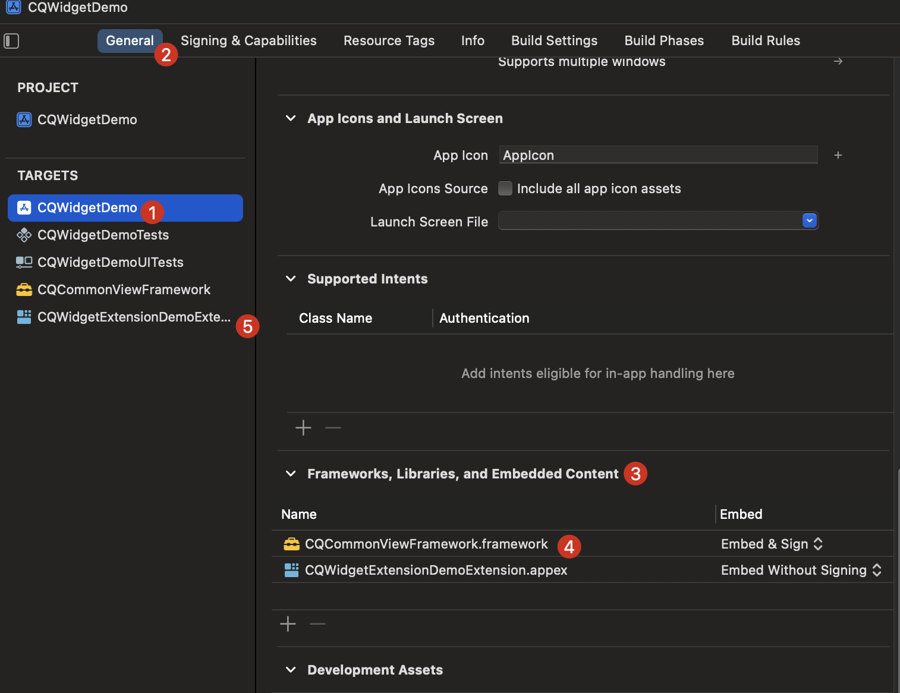
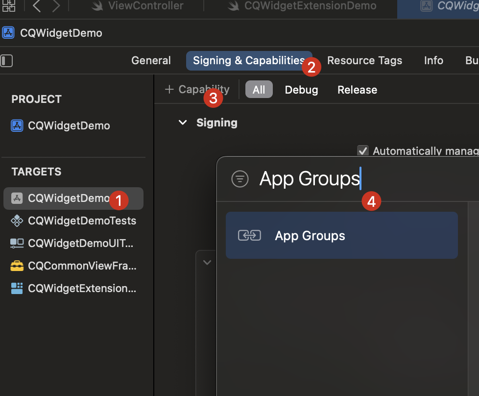
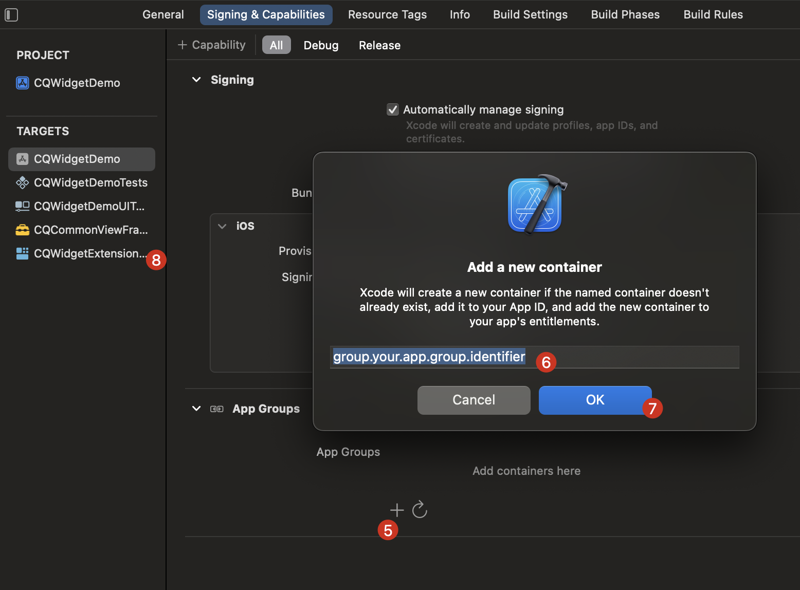

# 小组件教程
一个小组件工程的示例

* 主工程

- Widget Extension Target：小组件

- Framework Target：主工程和小组件中的公共视图（需要 public 修饰，及添加init()方法）

  1：选中要添加Framework的Target

  2-4：为选中的Target添加Framework

  5：选中小组件Target，并重复2-4为小组件Target添加Framework

- App Group：主工程和小组件的数据共享

  1：选中主工程Target

  2-7：为选中的Target添加 App Group（当前为主工程）

  8：选中小组件Target，并重复2-7为小组件Target添加App Group

   

## Widget Extension Target：小组件

## 版本介绍/更新记录
* 2018-08-29

> 1. 添加展示规范开发的初始示例CJStandardProjectDemo；

## 结束语
今天，先到这，有很多东西后面再完善补充。
