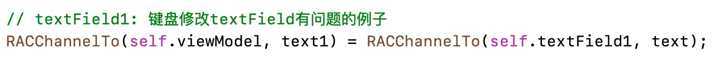
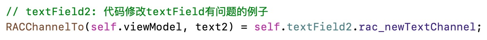
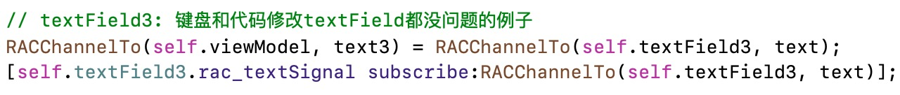
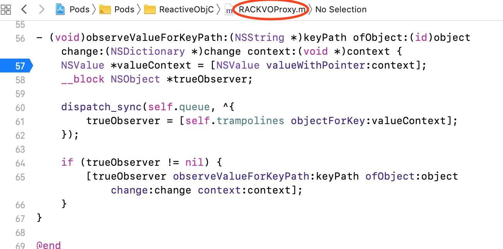

# 让你不知道怎么死的RAC

### 前言：RAC学习起来的特点

- 学习起来比较难

- 团队开发的时候需要谨慎使用

- 团队代码需要不断的评审,保证团队中所有人代码的风格一致!避免阅读代码的困难


## 一、RAC双向绑定UITextField的正确姿势

#### 1、先说结果

```objective-c
    // textField1: 键盘修改textField有问题的例子
    RACChannelTo(self.viewModel, text1) = RACChannelTo(self.textField1, text);
    
    // textField2: 代码修改textField有问题的例子
    RACChannelTo(self.viewModel, text2) = self.textField2.rac_newTextChannel;
    
    // textField3: 键盘和代码修改textField都没问题的例子
    RACChannelTo(self.viewModel, text3) = RACChannelTo(self.textField3, text);
    [self.textField3.rac_textSignal subscribe:RACChannelTo(self.textField3, text)];
```


比较结果如下列表所示：

|                         | 未完整的双向绑定1                                            | 未完整的双向绑定2                                            | 完整的双向绑定                                               |
| ----------------------- | ------------------------------------------------------------ | ------------------------------------------------------------ | ------------------------------------------------------------ |
| 代码文本                |  |  |  |
| 代码截图                | ```// textField1: 键盘修改textField有问题的例子```<br/>```RACChannelTo(self.viewModel, text1) = RACChannelTo(self.textField1, text);``` | ```// textField2: 代码修改textField有问题的例子```<br/>```RACChannelTo(self.viewModel, text2) = self.textField2.rac_newTextChannel;``` | ```// textField3: 键盘和代码修改textField都没问题的例子```<br/>```RACChannelTo(self.viewModel, text3) = RACChannelTo(self.textField3, text);```
```[self.textField3.rac_textSignal subscribe:RACChannelTo(self.textField3, text)];``` |
| textField               | textField1: 键盘修改textField有问题的例子                    | textField2: 代码修改textField有问题的例子                    | textField3: 键盘和代码修改textField都没问题的例子            |
| (通过代码)改变model时   | textField会改变                                              | textField会改变                                              | textField会改变                                              |
| 通过代码改变textField时 | model会改变                                                  | <u>model不会改变</u>                                         | model会改变                                                  |
| 通过键盘改变textField时 | <u>model不会改变</u>                                         | model会改变                                                  | model会改变                                                  |

#### 2、分析原因

要弄清为什么通过如上两种方式分别对textField1和textField2进行双向绑定会有问题，那么你需要先认识一下以下两个与textField有关的值的比较

|      |                                                              |                                                              |
| ---- | ------------------------------------------------------------ | ------------------------------------------------------------ |
|      | ```RACChannelTo(self.textField, text)```                     | ```self.textField.rac_newTextChannel```                      |
| 原理 | 当通过code改变self.textField.text的值的时候,才会把RACChannelTo(self.textField, text)这个值发送出去 | 当通过键盘改变self.textField.text的值的时候,才会把self.textField.rac_newTextChannel这个值发送出去 |
| 后果 | 所以只使用这个时，键盘修改textField会有问题                  | 所以只使用这个时，代码修改textField会有问题                  |


如果你还存疑惑，那么我们拿`textField1: 键盘修改textField有问题的例子`来说明：

```objective-c
    // textField1: 键盘修改textField有问题的例子
    RACChannelTo(self.viewModel, text1) = RACChannelTo(self.textField1, text);
```

我们在`RACKVOProxy`中的`observeValueForKeyPath`处设置断点，会发现，当我们只设置如上代码时候，通过键盘改变textField的值的时，其并未走入所设断点中，即其此时并未能检测到文本框的文本已经改变了。所以，也就出现了只设置如上代码，会出现当通过键盘改变文本框(键盘未收起)的时候，viewModel中的值没法改变的情况。

> 

同理，另一个的验证也如此。


#### 3、解决问题

下面我们对`RACChannelTo(self.viewModel, text3) = RACChannelTo(self.textField3, text);`绑定方式进行键盘修改的完善，完善方式如下：

```objective-c
    RACChannelTo(self.viewModel, text3) = RACChannelTo(self.textField3, text);
    @weakify(self);
    [self.textField3.rac_textSignal subscribeNext:^(NSString * _Nullable x) {
        @strongify(self);
        self.viewModel.text3 = x;
    }];
```

该部分代码，可简化为：

```objective-c
    RACChannelTo(self.viewModel, text3) = RACChannelTo(self.textField3, text);
    [self.textField3.rac_textSignal subscribe:RACChannelTo(self.textField3, text)];
```

即我们上诉开头时候的正确代码。


#### 4、实际应用中还存在的bindViewModel的问题

###### 4.1、在RAC绑定常见view中的textField的例子`RACBindNorTextFieldViewController`中

```objective-c
- (void)viewDidLoad {
    [super viewDidLoad];
    // Do any additional setup after loading the view.
    self.title = NSLocalizedString(@"RAC Bind Normal TextField", nil);
    [self setupViews];
    
    [self bindViewModel];
}
```


###### 4.2、在RAC绑定tableView中的textField的例子`RACBindTvTextFieldViewController`中

```objective-c
- (UITableViewCell *)tableView:(UITableView *)tableView cellForRowAtIndexPath:(NSIndexPath *)indexPath {
    RACTextFieldBindTableViewCell *cell = (RACTextFieldBindTableViewCell *)[tableView dequeueReusableCellWithIdentifier:@"RACTextFieldBindTableViewCell" forIndexPath:indexPath];
    cell.backgroundColor = [UIColor greenColor];
    
    if (indexPath.row == 0) {
        self.textField1 = cell.textField;
    } else if (indexPath.row == 1) {
        self.textField2 = cell.textField;
    } else if (indexPath.row == 2) {
        self.textField3 = cell.textField;
    }
    return cell;
}
```

那么bindViewModel的时机比较容易出错

```objective-c
- (void)viewDidLoad {
    [super viewDidLoad];
    // Do any additional setup after loading the view.
    self.title = NSLocalizedString(@"RAC Bind TableView TextField", nil);
    
    [self setupViews];
    //[self bindViewModel]; //textField未获取，无法进行绑定
}

- (void)viewWillAppear:(BOOL)animated {
    [super viewWillAppear:animated];
    //[self bindViewModel]; //textField未获取，无法进行绑定
}

- (void)viewDidAppear:(BOOL)animated {
    [super viewDidAppear:animated];
    [self bindViewModel];   //tableView中的textField绑定的正确时机
}
```


#### 5、遗留问题

遗留问题1：为什么只有键盘没回收时候的修改文本框值才有问题，而键盘回收时候不会也存在问题？

